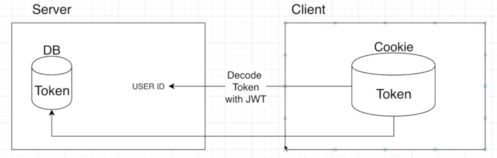

# MongoDB Express App만들기

## 환경변수 process.env.NODE_ENV

1. Local 환경에서 => development
2. Deploy(배포) 한 후 => production

- 마지막으로 비밀 정보가 있는 파일은 .gitignore에 담아주기.
  > config 폴더 확인 (dev.js를 ignore 해줬다.)

<br/>
<br/>

## 회원가입 기능

> Model: Schema를 감싸주는 역할

> Schema: 모델의 구성요소의 정보를 지정해주는 것

```javascript
//   models/User.js

const mongoose = require("mongoose");
const userSchema = mongoose.Schema({
  //스키마 생성
  name: {
    type: String,
    maxlength: 50,
  },
  email: {
    type: String,
    trim: true, //스페이스 없애주는 역할
    unique: 1,
  },
  password: {
    type: String,
    minlength: 5,
  },
  lastname: {
    type: String,
    maxlength: 50,
  },
  role: {
    type: Number,
    default: 0,
  },
  image: String,
  token: {
    type: String,
  },
  tokenExp: {
    type: Number,
  },
});

const User = mongoose.model("User", userSchema);

module.exports = { User };
```

```javascript
// index.js

const bodyParser = require("body-parser");
...
//aplication/x-www-form-urlencoded
app.use(bodyParser.urlencoded({ extended: true }));
//aplication/json
app.use(bodyParser.json());
...

app.post("/register", (req, res) => {
  //회원가입할때 필요한 정보를 클라이언트에서 가져오면 그것들을 DB에 넣어준다.
  const user = new User(req.body); //body-parser 덕분에 가능.

  user.save((err, doc) => {
    //mongoDB에 저장
    if (err) return res.json({ success: false, err });
    return res.status(200).json({
      success: true,
    });
  });
});
```

<br/>
<br/>

## bcrypt로 비밀번호 암호화 하기

- salt를 이용해서 비밀번호 암호화 하기.
- models/User.js 참고

```javascript
//    models/User.js
const bcrypt = require("bcrypt");
const saltRounds = 10;

...

userSchema.pre("save", function (next) {
  // save 직전에 호출되는 함수(mongoose)
  const user = this;
  if (user.isModified("password")) {
    //비밀번호 암호화 시키기
    bcrypt.genSalt(saltRounds, function (err, salt) {
      if (err) return next(err);

      bcrypt.hash(user.password, salt, function (err, hash) {
        if (err) return next(err);
        user.password = hash;
        next();
      });
    });
  } else {
    next();
  }
});
```

<br/>
<br/>

## 로그인 기능

1. 요청된 이메일을 데이터베이스에서 찾는다.
2. 요청된 이메일이 있다면 비밀번호가 맞는지 확인
3. 비밀번호까지 맞다면 토큰 생성
   - 토큰 생성을 위해 JSONWEBTOKEN 라이브러리 다운.

```javascript
//   index.js

const cookieParser = require("cookie-parser");
...
app.use(cookieParser());
...

app.post("/login", (req, res) => {
  //요청된 이메일을 데이터베이스에서 있는지 찾는다.
  User.findOne({ email: req.body.email }, (err, user) => {
    if (!user) {
      return res.json({
        loginSuccess: false,
        message: "제공된 이메일에 해당하는 유저가 없습니다.",
      });
    } else {
      //요청된 이메일이 데이터베이스에 있다면 비밀번호가 맞는 비밀번호인지 확인
      user.comparePassword(req.body.password, (err, isMatch) => {
        //User 메서드 직접만들어야함.
        if (!isMatch)
          return res.json({
            loginSuccess: false,
            message: "비밀번호가 틀렸습니다.",
          });
        //비밀번호까지 맞다면 토큰을 생성하기.
        user.generateToken((err, user) => {
          //User 메서드 직접만들어야함.
          if (err) return res.status(400).send(err);

          //토큰을 저장한다. 어디에? 쿠키, 로컬스토리지등 여러가지 방법이 있다.
          // 여기선 쿠키에 저장 => cookie-parser 설치
          res
            .cookie("x_auth", user.token)
            .status(200)
            .json({ loginSuccess: true, userId: user._id });
        });
      });
    }
  });
});
```

```javascript
//      models/User.js


const bcrypt = require("bcrypt");
const jwt = require("jsonwebtoken");


...


userSchema.methods.comparePassword = function (plainPassword, cb) {
  //암호화 한다음에 비교해야함.
  bcrypt.compare(plainPassword, this.password, function (err, isMatch) {
    if (err) return cb(err);
    cb(null, isMatch);
  });
};

userSchema.methods.generateToken = function (cb) {
  const user = this;
  //jsonwebtoken 을 이용해서 token 을 생성하기.
  const token = jwt.sign(user._id.toHexString(), "secretToken");
  // user._id , scretToken으로  token 을 생성

  user.token = token;
  user.save(function (err, user) {
    if (err) return cb(err);
    cb(null, user);
  });
};
```

<br/>
<br/>

## Auth 기능 만들기

> Auth 기능의 이유

1. 페이지 이동 때마다 로그인되어있는지 안되어있는지 체크.
2. 글을 쓸때나 지울때 같은데 권한이 있는지 체크.



> 과정

1. 쿠키에 저장된 Token을 가져와서 복호화를 한다.
2. 토큰을 이용해서 DB에서 user를 찾는다.

```javascript
//    index.js
...

app.get("/api/users/auth", auth, (req, res) => {
  //여기까지 미들웨어를 통과해 왔다면 Authentication이 True라는 말.
  res.status(200).json({
    _id: req.user._id,
    //role 0 => 일반유저 아니면 관리자
    isAdmin: req.user.roll === 0 ? false : true,
    isAuth: true,
    email: req.user.email,
    name: req.user.name,
    lastname: req.user.lastname,
    role: req.user.role,
    image: req.user.image,
  });
});
```

```javascript
//      midleware/auth.js
const { User } = require("../models/User");

let auth = (req, res, next) => {
  //인증처리를 하는곳.
  // 1. 클라이언트 쿠키에서 토큰을 가져옴.
  let token = req.cookies.x_auth;

  // 2, 토큰을 복호화한후 유저를 찾는다.
  User.findByToken(token, (err, user) => {
    if (err) throw err;
    if (!user) return res.json({ isAuth: false, error: true });
    req.token = token;
    req.user = user;
    next();
  });
  // 3. 유저가 있으면 인증 okay
  // 4. 유저가 없으면 인증 no
};
module.exports = { auth };
```

```javascript
// models/User.js 에 findByToken()메서드.

userSchema.statics.findByToken = function (token, cb) {
  var user = this;

  //토큰을 decode 한다.
  jwt.verify(token, "secretToken", function (err, deocded) {
    //유저 아이디를 이용해서 유저를 찾은 다음에
    //클라이언트에서 가져온 token 과 DB에 보관된 토큰이 일치하는지 과인

    user.findOne({ _id: deocded, token: token }, function (err, user) {
      if (err) return cb(err);
      cb(null, user);
    });
  });
};
```

<br/>
<br/>

## 로그아웃 기능 만들기

> 로그아웃하려는 유저를 데이터베이스에서 찾아서 그 유저의 토큰을 지워준다.

```javascript
//    index.js
...

app.get("/api/users/logout", auth, (req, res) => {
  User.findOneAndUpdate({ _id: req.user._id }, { token: "" }, (err, user) => {
    if (err) return res.json({ success: false, err });
    return res.status(200).send({
      success: true,
    });
  });
});
```
